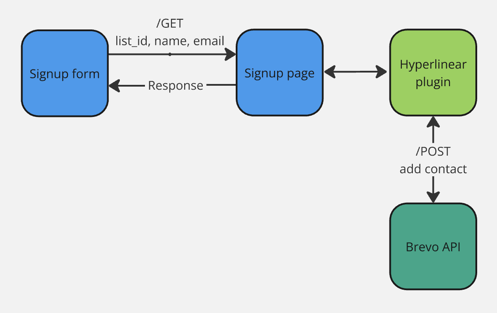
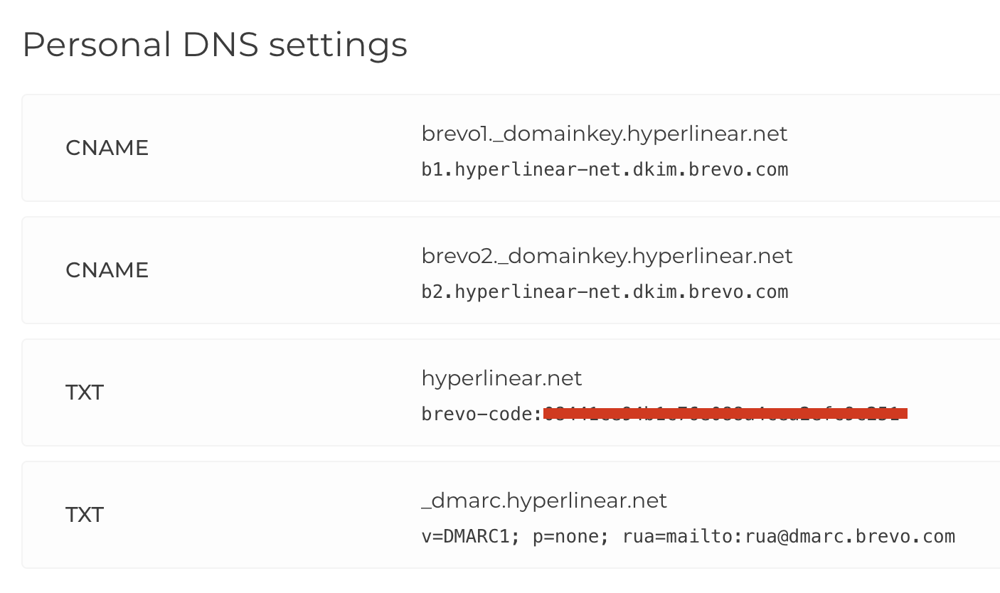
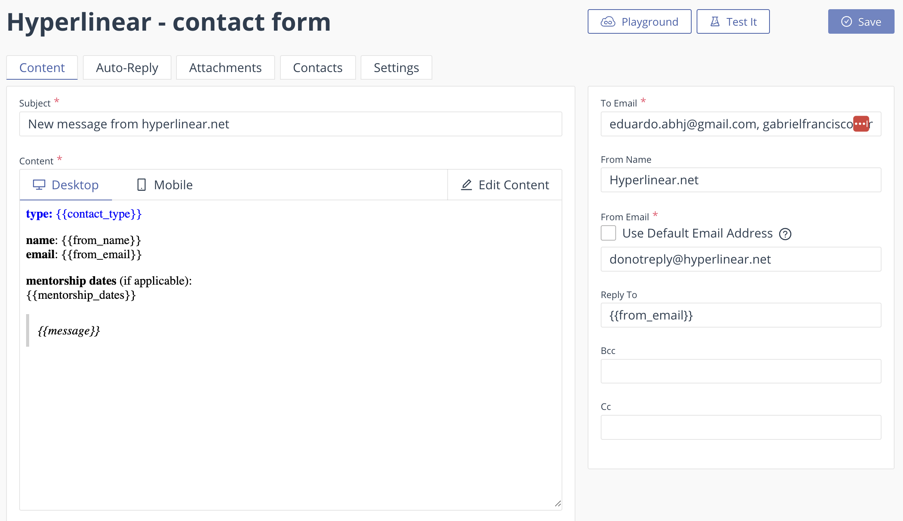

# Hyperlinear Plugin: newsletter signup

## Overview

The **Hyperlinear Plugin** is a custom WordPress plugin developed to streamline the process of adding users to a Brevo contact list for email marketing campaigns.



## Requirements

1. The current newsletter setup requires a Brevo acccount - https://www.brevo.com. This service will handle the contact lists and email sending.
    - For security reasons, Brevo requires you to authenticate your domain by adding certain DNS records to your hosting provider (check [docs](https://help.brevo.com/hc/en-us/articles/12163873383186-Authenticate-your-domain-with-Brevo-Brevo-code-DKIM-record-DMARC-record)). The image below shows the config changed in One.com's DNS editor.
    

## Installation

1. The plugin expects that a Wordpress page with slug `/newsletter-signup` exists - this page can be empty. A client-side GET request will be made to this endpoint to trigger the sign-up logic.

2. The sign-up form code (check `pages/newsletter_form.html`)  must be inserted in a Wordpress page as an HTML block, currently configured in `/newsletter-form`. The Brevo contact list ID is currently set to `2`, change this value in the Wordpress page to switch to a different list.

2. Upload the plugin `*.php` files to the WordPress directory:  
    `/wp-content/plugins/hyperlinear-plugin`.

3. Create a `.env` file in the plugin directory. It must contain the following keys with respective values:
```
BREVO_API_KEY=xxx
BREVO_ENDPOINT=https://api.brevo.com/v3/contacts
```
This repo contains a `.env.local` copy of this file. Rename it to `.env` and fill it out with the correct values.

4. Activate the plugin:
- Go to your WordPress admin dashboard.
- Navigate to **Plugins** > **Installed Plugins**.
- Find the "Hyperlinear Plugin" and click **Activate**.


## Error Messages

The plugin provides error messages for various scenarios. The errors will be returned as http status codes when calling `/newsletter-signup`

- **400 Bad Request**:
  - Missing required parameters (`first_name`, `last_name`, `email`, or `list_id`).
  - Example message: "Missing required parameters: first_name, last_name, or email."

- **409 Conflict**:
  - The email address is already registered in the Brevo contact list.
  - Example message: "Sorry, the provided email is already registered."

- **500 Internal Server Error**:
  - Failure to connect to the Brevo API.
  - Example message: "Failed to connect to Brevo API."

# Contact form

- The contact form uses Email.js - https://www.emailjs.com. This service was chosen because the standard email sending via PHP was not working by default, so a client-side solution was an easy way out of this. 

- At the moment, my personal Email.js account is in use, but can be easily switched to any other by simply changing the ID. To find this value, do the following:
  - In [emailjs.com](https://www.emailjs.com), go to `Account` and find the Public key provided.
  - This value must be added to the contact form Javascript code, published in the Contact page. The line to be edited looks like (replace xxx witht the actual value):
    - `emailjs.init("xxx");`

- HTML and Javascript code was implemented and published in the Contact page in Wordpress (check `pages/contact_form.html`). The code will get the contents from the contact form and will forward it to Email.js, which will then relay the message to the site admins using a predefined email template.

- The email template can be configured this way:

  - Login to your [emailjs.com](https://www.emailjs.com) account
  - Go to `Email Templates`, then create/edit a template
  - Click `Edit content` and find the `Code editor` so you can add html code
  - Use the template available in `emailjs/template.html` in this repository, or create your own.
    - The provided template contains variables like from_name, from_email, message, etc. These values will be replaced by the contents of the contact form, so it is advised to use them.
  - The `To Email` field contains the email recipients - i.e. the page admins that will receive the message
  - `From Name` is the sender name
  - `From Email` can be any email, even if non-existing. 
  - `Reply To` is currently set with the user email.  